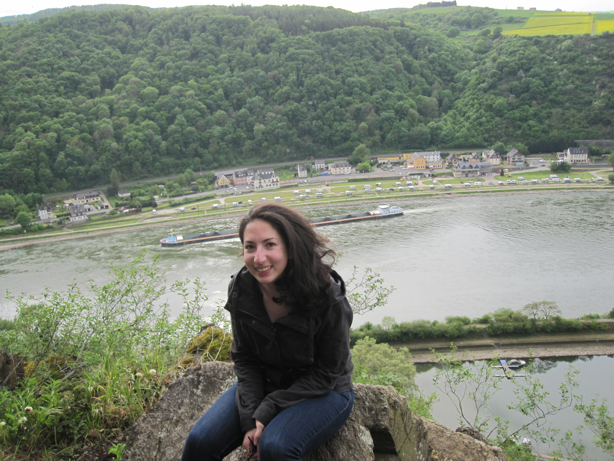

---
# You don''t need to edit this file, it''s empty on purpose.
# Edit theme''s home layout instead if you wanna make some changes
# See: https://jekyllrb.com/docs/themes/#overriding-theme-defaults
layout: default
---

 

I am an Assistant Professor in [Computer Science](https://www.cs.umd.edu/) at the University of Maryland, College Park.
I also hold appointments in [UMIACS](https://www.umiacs.umd.edu/) and [Linguistics](https://linguistics.umd.edu/) at UMD.

My research focuses on problems in natural language understanding, including
knowledge acquisition, commonsense reasoning, an semantic representation.
I am also interested in problems of bias and fairness in NLP, and in particular
how commonsense reasoning can both lead to and help overcome social
overgeneralization in NLP systems.
